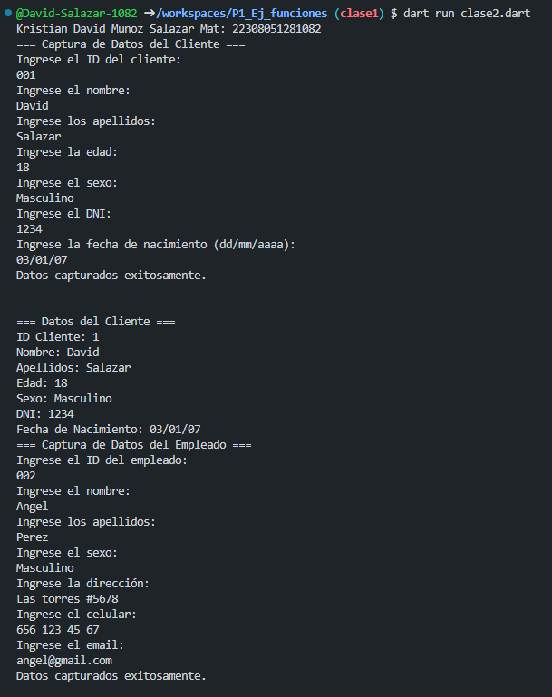
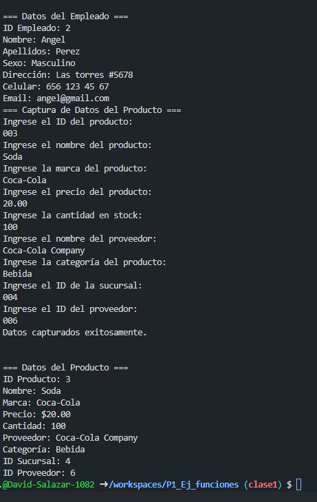

crear una clase clientes con  atributos (id_cliente, nombre, apellidos, edad, sexo, dni, fecha de nacimiento), una función captura() desde la interfaz y otra mostrarDatos(), 
---
crear la instancia y utilizar los atributos y llamadas a función lenguaje dart
---
crear una clase clientes con  atributos (id_empleado, nombre, apellidos, sexo, direccion, celular, email), una función captura() desde la interfaz y otra mostrarDatos(), crear la instancia y utilizar los atributos y llamadas a función lenguaje dart
---

---
