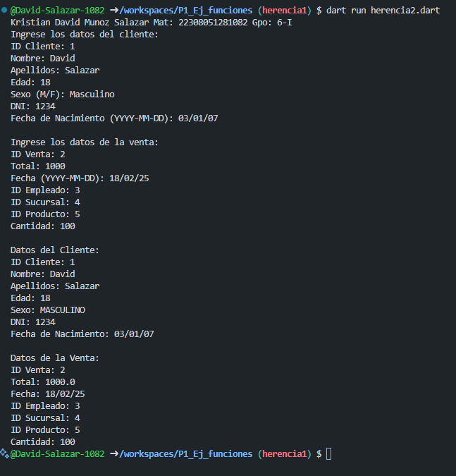

crear 2 clases Clientes  Ventas, los atributos de clientes son (id_cliente, nombre, apellidos, edad, sexo, dni, fecha_nacimiento) con una función capturadatos(), los atributos de ventas son (id_venta, total, fecha, id_empleado, id_cliente, id_sucursal, id_producto, cantidad) con interacción de interfaz de usuario. crear la clase DatosCliente y la clase DatosVenta con herencia entre las dos clases y una función mostrarDatos(). lenguaje dart

salida de datos

