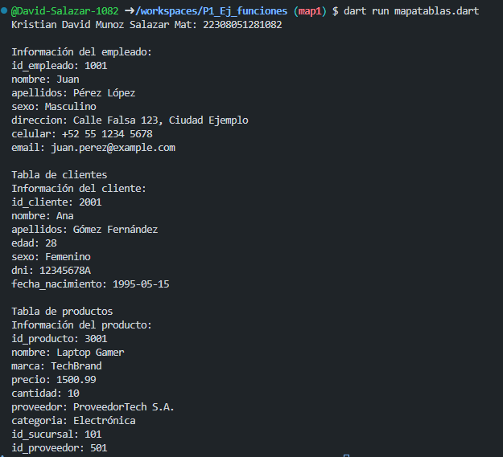

crear map <string, dinamic> empleado con los siguientes key, id_empleado, nombre, apellidos, sexo, direccion, celular, email . y mostrar los resultados con un for each, lenguaje dart
----
crear map <string, dinamic> empleado con los siguientes key, id_cliente, nombre, apellidos, edad, sexo, dni, fecha_nacimiento. y mostrar los resultados con un for each, lenguaje dart
----
crear map <string, dinamic> empleado con los siguientes key, id_producto, nombre, marca, precio, cantidad, proveedor, categoria, id_sucursal, id_proveedor . y mostrar los resultados con un for each, lenguaje dart
----
